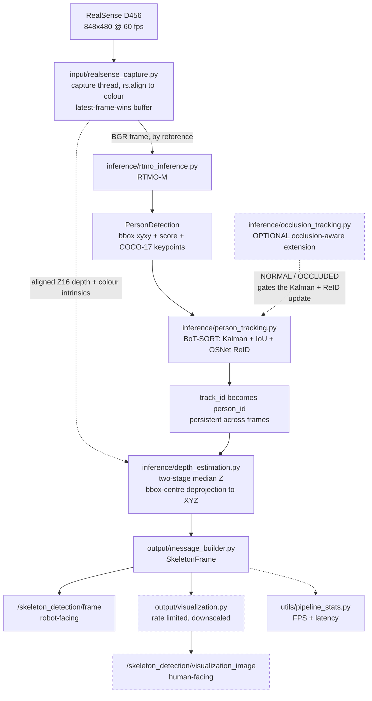

# Skeleton Detection — IoT perception subsystem

Real-time multi-person skeleton detection, tracking and 3D localization on an
NVIDIA DGX Spark, using an Intel RealSense D456, RTMO-M, ROS 2 Humble and
BoT-SORT + OSNet ReID.

## Project overview

This is the IoT / skeleton-detection subsystem. One ROS 2 node
(executable `iot_node`, node name `rtmo_node`) runs the whole perception path
in a single Python process and does the following:

- **RealSense RGB/depth capture** — the D456 is opened in-process with
  `pyrealsense2`; depth is aligned to colour in the capture thread.
- **RTMO skeleton detection** — RTMO-M multi-person 2D pose, COCO-17 keypoints,
  per-person bounding boxes and confidence scores.
- **BoT-SORT person tracking** — persistent track IDs from motion/IoU plus
  optional OSNet appearance ReID.
- **Optional occlusion-aware tracking** — an extension of that tracking path
  that protects a track's Kalman and ReID state while a person is occluded.
- **Depth estimation** — a robust per-person Z from the aligned depth image.
- **XYZ localization** — the person's 3D position in meters in the camera
  colour **optical** frame.
- **ROS 2 publication** — a custom robot-facing `SkeletonFrame` message.
- **Visualization** — a separate human-facing annotated image topic, and
  optional annotated files on disk.

The live path is deliberately kept inside **one node / one process** so the
high-bandwidth RealSense RGB stream never has to cross DDS before inference or
tracking. DDS starts only at the outputs.

## Pipeline



The solid path is the per-frame execution order, and it is **strictly
sequential**: RTMO, then tracking, then depth/XYZ, then the message. Tracking
runs before the message is built so `person_id` is already the persistent track
ID at publication time; depth runs after tracking and before the message so
`person_id` and `position` describe the same detection.

With `enable_tracking:=false` the tracking stage is skipped entirely and
`person_id` is the frame-local detection index. Occlusion-aware tracking is an
**optional extension of the tracking stage**, not a separate path — it is off
by default and requires tracking to be on.

## Repository structure

```text
skeleton_detection/
├── iot_node.py          ROS 2 orchestration node
├── input/               frame sources (camera, test images)
├── inference/           RTMO, tracking, occlusion, depth/XYZ
├── output/              ROS messages and visualization
└── utils/               shared statistics and constants
```

| Group | Responsibility |
|---|---|
| `iot_node.py` | the only runtime orchestration: parameters, publishers, threads, lifecycle |
| `input/` | produces frames — the live RealSense camera or offline test images |
| `inference/` | everything that turns a frame into tracked, localized people |
| `output/` | turns internal detections into ROS messages and rendered overlays |
| `utils/` | shared, dependency-free helpers used across the pipeline |

Supporting directories: `config/` (YAML parameter files), `launch/` (ROS 2
launch files), `msg/` (message definitions), `models/rtmo/` (the git-tracked
RTMO config), `docker/` (Dockerfile and build helpers), `test/` (pytest suite).

## Module overview

### `iot_node.py`

The main ROS 2 orchestration node. It owns the full per-frame sequence —
capture → inference → tracking → depth → message → visualization — plus every
ROS parameter, both publishers, the capture/inference threading and the node
lifecycle. All the actual work lives in the focused modules below.

Configurable parameter **groups**: input selection, RealSense capture, RTMO
model, depth/XYZ, tracking and ReID, occlusion-aware tracking, visualization,
and runtime/statistics.

Key parameters: `input_mode`, `enable_tracking`, `with_reid`,
`publish_visualization_image`, `run_duration_sec` (a **double** — pass `30.0`,
not `30`).

→ full list in [docs/parameters.md](docs/parameters.md)

### Input

#### `input/realsense_capture.py`

Owns the `rs.pipeline`. A dedicated capture thread pulls framesets, runs
`rs.align(rs.stream.color)` so the Z16 depth shares the colour pixel grid, and
drops the arrays into a **single-slot, latest-frame-wins** buffer — if
inference falls behind, the newest frame overwrites the unconsumed one and the
old one is counted as dropped, so latency stays bounded. The colour intrinsics
and the device depth scale are read once at start-up.

Key parameters: `realsense_width`, `realsense_height`, `realsense_fps`,
`realsense_color_format`, `realsense_enable_depth`, `realsense_serial`,
`camera_frame_id`.

→ [docs/parameters.md](docs/parameters.md) ·
[docs/architecture.md](docs/architecture.md)

#### `input/image_publisher.py`

The offline/test input path: publishes local images as `sensor_msgs/Image` so
the node can be exercised end-to-end with no camera. Used by the image-based
launch and test workflow (`milestone1.launch.py`), with the node in
`input_mode: ros_topic`.

Key parameters: `image_paths`, `image_dir`, `image_path`, `output_topic`,
`publish_interval_sec`.

→ [docs/running.md](docs/running.md)

### Inference

#### `inference/rtmo_inference.py`

Loads RTMO-M once (config + checkpoint, with the torch ≥ 2.6 checkpoint-loading
workaround), runs bottom-up inference on the BGR frame and parses the results
into `PersonDetection` objects — `xyxy` box, person score and 17 COCO keypoints
with per-joint confidences, all in original image pixels. The keypoint layout is
verified against COCO-17 at start-up.

Key parameters: `model_config`, `checkpoint`, `device`,
`person_score_threshold`.

→ [docs/parameters.md](docs/parameters.md) ·
[docs/implementation.md](docs/implementation.md)

#### `inference/person_tracking.py`

A thin wrapper around one BoT-SORT instance and one OSNet ReID model, both
built once. It handles Kalman prediction, IoU/appearance association, the track
lifecycle and ID assignment, and maps BoxMOT's `det_ind` column back onto the
exact detection — and therefore the exact keypoints — that produced each track.

Key parameters: `enable_tracking`, `with_reid`, `track_buffer` (90),
`proximity_thresh` (0.70, an IoU **distance** — raising it relaxes the gate),
`match_thresh`, `appearance_thresh`, `tracking_frame_rate`, `cmc_method`.

→ [docs/parameters.md](docs/parameters.md) ·
[docs/architecture.md](docs/architecture.md)

#### `inference/occlusion_tracking.py`

An optional, experimental extension of the tracking path. It classifies each
matched observation as `NORMAL` or `OCCLUDED` from a single signal — the
fraction of visible RTMO keypoints — and for an `OCCLUDED` one it protects the
track's state: Kalman **prediction** still runs but the measurement update is
skipped, and the ReID feature is frozen. The track keeps its ID in both states,
and no association logic changes.

Key parameters: `occlusion_aware_tracking`, `keypoint_visibility_threshold`,
`visible_ratio_threshold`.

→ [docs/architecture.md](docs/architecture.md)

#### `inference/depth_estimation.py`

Per-person depth and 3D position, in pure NumPy. Depth is sampled from the
aligned depth image at each visible keypoint and reduced with a **two-stage
median** (3 × 3 neighbourhood per joint, then across joints) — a median at both
stages, because depth around a person is bimodal and a mean would place them in
empty space. The bbox centre is then deprojected at that Z with the colour
intrinsics to give XYZ in the camera optical frame; `depth` is the Euclidean
`sqrt(X²+Y²+Z²)`, not the raw RealSense Z. Unavailable is `NaN`, never `0`.

Key parameters: `depth_keypoint_score_threshold`, `depth_min_m`, `depth_max_m`.

→ [docs/architecture.md](docs/architecture.md)

### Output

#### `output/message_builder.py`

The single owner of the internal → ROS conversion. It builds `SkeletonFrame`
and its `PersonSkeleton` entries, publishing `person_id`, `score`, `bbox`
(converted from `xyxy` to `[x, y, width, height]`), the 17 joints flattened to
51 floats, the 19 COCO connections, `position` and `depth`.

→ [docs/running.md](docs/running.md) (message fields) ·
[docs/architecture.md](docs/architecture.md)

#### `output/visualization.py`

The single drawing implementation: skeletons, bounding boxes, and per-person
ID / score / depth (and optionally XYZ) overlays, plus a legend stating what
the drawn ID currently means. It feeds two sinks from one render — the
rate-limited, downscaled `/skeleton_detection/visualization_image` topic and
optional full-resolution files on disk.

Key parameters: `publish_visualization_image`, `visualization_width`,
`visualization_height`, `visualization_fps`, `visualization_reliability`,
`joint_score_threshold`, `draw_person_xyz`, `save_visualization_images`.

→ [docs/parameters.md](docs/parameters.md)

### Utils

#### `utils/pipeline_stats.py`

FPS, latency and runtime statistics. Keeps RTMO time, tracking time and total
processing time as separate series (they are never summed into one number),
with mean / median / p95 / min / max for the periodic log line and the shutdown
summary.

#### `utils/coco_keypoints.py`

The shared COCO-17 constants: the 17 keypoint names, the 19-edge skeleton
topology, and the flattened form published in `PersonSkeleton.connections`.

## Documentation

- [Setup](docs/setup.md) — prerequisites, host and hardware expectations,
  repository setup
- [Docker & Compose](docs/docker.md) — image build, the Compose workflow, GPU
  and device access, when a rebuild is needed
- [Running the pipeline](docs/running.md) — `colcon build`, launch commands,
  visualization, topic inspection, message fields
- [Parameters](docs/parameters.md) — the complete parameter reference
- [Architecture](docs/architecture.md) — module responsibilities, data flow,
  execution order, algorithms
- [Debugging](docs/debugging.md) — camera, Docker, X11, DDS, performance,
  tracking and build troubleshooting
- [Implementation notes](docs/implementation.md) — model assets, dependency
  workarounds, data structures, coordinate conventions
- [Package audit](docker/PACKAGES.md) — the pinned dependency stack and why
  each version is what it is

## Quick start

```bash
docker compose build
docker compose up -d
docker compose exec skeleton_humble bash
```

then, inside the container:

```bash
source /opt/ros/humble/setup.bash
cd /ros2_ws && colcon build --packages-select skeleton_detection
source /ros2_ws/install/setup.bash

ros2 launch skeleton_detection milestone2_realsense_rtmo.launch.py \
  enable_tracking:=true run_duration_sec:=30.0
```

See [docs/docker.md](docs/docker.md) and [docs/running.md](docs/running.md) for
the full workflow.
