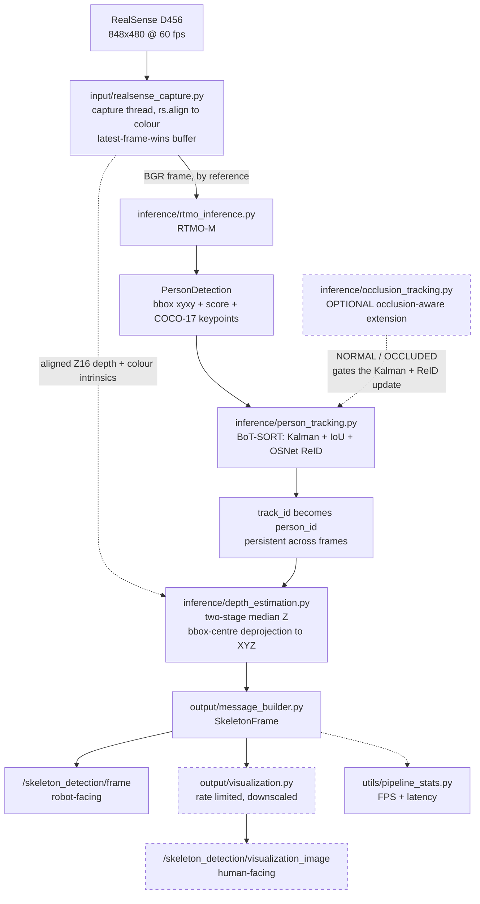

# Skeleton Detection — IoT perception subsystem

Real-time multi-person skeleton detection, tracking and 3D localization on an
NVIDIA DGX Spark, using an Intel RealSense D456, RTMO-M, ROS 2 Humble and
BoT-SORT + OSNet ReID.

## Project overview

This is the IoT / skeleton-detection subsystem. One ROS 2 node
(executable `iot_node`, node name `rtmo_node`) runs the whole perception path
in a single Python process and does the following:

- **RealSense RGB/depth capture** — the D456 is opened in-process with
  `pyrealsense2`; depth is aligned to colour in the capture thread.
- **RTMO skeleton detection** — RTMO-M multi-person 2D pose, COCO-17 keypoints,
  per-person bounding boxes and confidence scores.
- **BoT-SORT person tracking** — persistent track IDs from motion/IoU plus
  optional OSNet appearance ReID.
- **Optional occlusion-aware tracking** — an extension of that tracking path
  that protects a track's Kalman and ReID state while a person is occluded.
- **Depth estimation** — a robust per-person Z from the aligned depth image.
- **XYZ localization** — the person's 3D position in meters in the camera
  colour **optical** frame.
- **ROS 2 publication** — a custom robot-facing `SkeletonFrame` message.
- **Visualization** — a separate human-facing annotated image topic, and
  optional annotated files on disk.

The live path is deliberately kept inside **one node / one process** so the
high-bandwidth RealSense RGB stream never has to cross DDS before inference or
tracking. DDS starts only at the outputs.

## Pipeline



The solid path is the per-frame execution order, and it is **strictly
sequential**: RTMO, then tracking, then depth/XYZ, then the message. Tracking
runs before the message is built so `person_id` is already the persistent track
ID at publication time; depth runs after tracking and before the message so
`person_id` and `position` describe the same detection.

With `enable_tracking:=false` the tracking stage is skipped entirely and
`person_id` is the frame-local detection index. Occlusion-aware tracking is an
**optional extension of the tracking stage**, not a separate path — it is off
by default and requires tracking to be on.

## Repository structure

```text
skeleton_detection/
├── iot_node.py          ROS 2 orchestration node
├── input/               frame sources (camera, test images)
├── inference/           RTMO, tracking, occlusion, depth/XYZ
├── output/              ROS messages and visualization
└── utils/               shared statistics and constants
```

| Group | Responsibility |
|---|---|
| `iot_node.py` | the only runtime orchestration: parameters, publishers, threads, lifecycle |
| `input/` | produces frames — the live RealSense camera or offline test images |
| `inference/` | everything that turns a frame into tracked, localized people |
| `output/` | turns internal detections into ROS messages and rendered overlays |
| `utils/` | shared, dependency-free helpers used across the pipeline |

Supporting directories: `config/` (YAML parameter files), `launch/` (ROS 2
launch files), `msg/` (message definitions), `models/rtmo/` (the git-tracked
RTMO config), `docker/` (Dockerfile and build helpers), `test/` (pytest suite).

## Documentation

- [Setup](docs/setup.md) — prerequisites, host and hardware expectations,
  repository setup
- [Docker & Compose](docs/docker.md) — image build, the Compose workflow, GPU
  and device access, when a rebuild is needed
- [Running the pipeline](docs/running.md) — `colcon build`, launch commands,
  visualization, topic inspection, message fields
- [Launch arguments](docs/launch_arguments.md) — every `ros2 launch`
  argument, its default and what it does
- [Parameters](docs/parameters.md) — the complete parameter reference
- [Architecture](docs/architecture.md) — module responsibilities, data flow,
  execution order, algorithms
- [Debugging](docs/debugging.md) — camera, Docker, X11, DDS, performance,
  tracking and build troubleshooting
- [Implementation notes](docs/implementation.md) — model assets, dependency
  workarounds, data structures, coordinate conventions
- [Package audit](docker/PACKAGES.md) — the pinned dependency stack and why
  each version is what it is

## Quick start

```bash
docker compose build
docker compose up -d
docker compose exec skeleton_humble bash
```

then, inside the container:

```bash
source /opt/ros/humble/setup.bash
cd /ros2_ws && colcon build --packages-select skeleton_detection
source /ros2_ws/install/setup.bash

ros2 launch skeleton_detection skeleton_detection_bringup.launch.py \
  enable_tracking:=true \
  with_reid:=true \
  occlusion_aware_tracking:=true \
  publish_visualization_image:=true \
  draw_person_xyz:=true
```

See [docs/docker.md](docs/docker.md) and [docs/running.md](docs/running.md) for
the full workflow.
