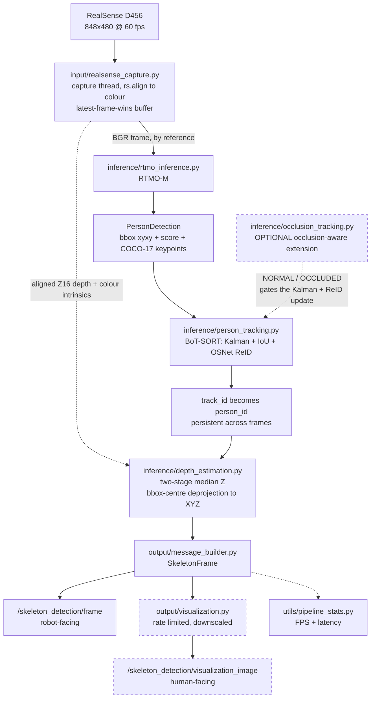

# Skeleton Detection — IoT perception subsystem

Real-time multi-person skeleton detection, tracking and 3D localization on an
NVIDIA DGX Spark, using an Intel RealSense D456, RTMO-M, ROS 2 Humble and
BoT-SORT + OSNet ReID.

## Project overview

This is the IoT / skeleton-detection subsystem. One ROS 2 node
(executable `iot_node`, node name `rtmo_node`) runs the whole perception path
in a single Python process and does the following:

- **RealSense RGB/depth capture** — the D456 is opened in-process with
  `pyrealsense2`; depth is aligned to colour in the capture thread. An
  external `realsense2_camera` driver can be consumed instead, over a single
  RGBD topic — see [Input modes](#input-modes).
- **RTMO skeleton detection** — RTMO-M multi-person 2D pose, COCO-17 keypoints,
  per-person bounding boxes and confidence scores.
- **BoT-SORT person tracking** — persistent track IDs from motion/IoU plus
  optional OSNet appearance ReID.
- **Optional occlusion-aware tracking** — an extension of that tracking path
  that protects a track's Kalman and ReID state while a person is occluded.
- **Depth estimation** — a robust per-person Z from the aligned depth image.
- **XYZ localization** — the person's 3D position in meters in the camera
  colour **optical** frame.
- **ROS 2 publication** — a custom robot-facing `SkeletonFrame` message.
- **Visualization** — a separate human-facing annotated image topic, and
  optional annotated files on disk.

The live path is deliberately kept inside **one node / one process** so the
high-bandwidth RealSense RGB stream never has to cross DDS before inference or
tracking. DDS starts only at the outputs.

## Input modes

`input_mode` selects the frame source. All three converge on the same
RTMO → tracking → depth → `SkeletonFrame` pipeline; nothing downstream changes.

| `input_mode` | Frames from | Depth / XYZ | Typical use |
|---|---|---|---|
| `realsense` | the D456, opened **in this process** with `pyrealsense2` | yes, aligned in-process | optional direct camera mode (`config/rtmo_node_direct_realsense.yaml`) |
| `ros_topic` | a colour-only `sensor_msgs/Image` topic | no — `NaN` | offline / dummy-publisher testing |
| `ros_camera` (default) | one `realsense2_camera_msgs/msg/RGBD` topic from an **externally running** driver | yes, aligned **by the driver** | the camera is owned by another container (`config/skeleton_detection_node.yaml`) |

In `ros_camera` mode the **external driver** is responsible for enabling
colour, enabling depth, RGB/depth synchronization, depth-to-colour alignment
and publishing the RGBD topic. Skeleton Detection only consumes the resulting
message — it never launches `realsense2_camera`, opens no camera and calls no
`rs.align`. The driver is expected to run with `enable_rgbd:=true`,
`enable_sync:=true`, `align_depth.enable:=true`, `enable_color:=true`,
`enable_depth:=true`.

```bash
# default: config/skeleton_detection_node.yaml (input_mode: ros_camera)
ros2 launch skeleton_detection skeleton_detection_bringup.launch.py

# open the D456 in this process instead: the mode is chosen by the config
# file, not a launch argument
ros2 launch skeleton_detection skeleton_detection_bringup.launch.py \
  config:=/opt/skeleton_detection/share/skeleton_detection/config/rtmo_node_direct_realsense.yaml
```

Details in [Input modes](docs/running.md#3-input-modes).

## Pipeline


```mermaid
flowchart TD
    RS["RealSense D456<br/>848x480 @ 60 fps"]
    CAP["input/realsense_capture.py<br/>capture thread, rs.align to colour<br/>latest-frame-wins buffer"]
    RTMO["inference/rtmo_inference.py<br/>RTMO-M"]
    DET["PersonDetection<br/>bbox xyxy + score + COCO-17 keypoints"]
    TRK["inference/person_tracking.py<br/>BoT-SORT: Kalman + IoU + OSNet ReID"]
    OCC["inference/occlusion_tracking.py<br/>OPTIONAL occlusion-aware extension"]
    IDS["track_id becomes person_id<br/>persistent across frames"]
    DEPTH["inference/depth_estimation.py<br/>two-stage median Z<br/>bbox-centre deprojection to XYZ"]
    MSG["output/message_builder.py<br/>SkeletonFrame"]
    TOPIC["/skeleton_detection/frame<br/>robot-facing"]
    VIZ["output/visualization.py<br/>rate limited, downscaled"]
    VTOPIC["/skeleton_detection/visualization_image<br/>human-facing"]
    STATS["utils/pipeline_stats.py<br/>FPS + latency"]

    RS --> CAP
    CAP -->|"BGR frame, by reference"| RTMO
    CAP -.->|"aligned Z16 depth + colour intrinsics"| DEPTH
    RTMO --> DET
    DET --> TRK
    OCC -.->|"NORMAL / OCCLUDED<br/>gates the Kalman + ReID update"| TRK
    TRK --> IDS
    IDS --> DEPTH
    DEPTH --> MSG
    MSG --> TOPIC
    MSG --> VIZ
    VIZ --> VTOPIC
    MSG -.-> STATS

    classDef optional stroke-dasharray: 5 5
    class OCC,VIZ,VTOPIC optional
```

The solid path is the per-frame execution order, and it is **strictly
sequential**: RTMO, then tracking, then depth/XYZ, then the message. Tracking
runs before the message is built so `person_id` is already the persistent track
ID at publication time; depth runs after tracking and before the message so
`person_id` and `position` describe the same detection.

`person_id >= 0` is always a persistent tracker ID; `person_id == -1` means the
detection has no persistent identity right now (a new track not yet confirmed,
an unmatched detection, or tracking off). Such people are still published with
their skeleton, bbox and position. With `enable_tracking: false` the tracking
stage is skipped entirely and every `person_id` is `-1`. Occlusion-aware tracking is an
**optional extension of the tracking stage**, not a separate path — it is off
by default and requires tracking to be on.

## Repository structure

```text
skeleton_detection/
├── iot_node.py          ROS 2 orchestration node
├── input/               frame sources (camera, test images)
├── inference/           RTMO, tracking, occlusion, depth/XYZ
├── output/              ROS messages and visualization
└── utils/               shared statistics and constants
```

| Group | Responsibility |
|---|---|
| `iot_node.py` | the only runtime orchestration: parameters, publishers, threads, lifecycle |
| `input/` | produces frames — the live RealSense camera or offline test images |
| `inference/` | everything that turns a frame into tracked, localized people |
| `output/` | turns internal detections into ROS messages and rendered overlays |
| `utils/` | shared, dependency-free helpers used across the pipeline |

Supporting directories: `config/` (YAML parameter files), `launch/` (ROS 2
launch files), `models/rtmo/` (the git-tracked
RTMO config), `docker/` (Dockerfile and build helpers), `test/` (pytest suite).
The message definitions live in the separate `patrolknight_msgs` package.

## Documentation

- [Setup](docs/setup.md) — prerequisites, host and hardware expectations,
  repository setup
- [Docker & Compose](docs/docker.md) — image build, the Compose workflow, GPU
  and device access, when a rebuild is needed
- [Running the pipeline](docs/running.md) — launch commands,
  visualization, topic inspection, message fields
- [Launch arguments](docs/launch_arguments.md) — the single `config:=`
  argument and how to select or edit a parameter file
- [Parameters](docs/parameters.md) — the complete parameter reference
- [Architecture](docs/architecture.md) — module responsibilities, data flow,
  execution order, algorithms
- [Debugging](docs/debugging.md) — camera, Docker, X11, DDS, performance,
  tracking and build troubleshooting
- [Implementation notes](docs/implementation.md) — model assets, dependency
  workarounds, data structures, coordinate conventions
- [Package audit](docker/PACKAGES.md) — the pinned dependency stack and why
  each version is what it is

## Quick start

```bash
docker compose build
docker compose up -d
```

The image contains both built packages; `up` starts the pipeline with
`config/skeleton_detection_node.yaml` (external RealSense RGBD topic, tracking +
ReID + occlusion-aware tracking + visualization), mounted read-only into the
container. Edit that file and restart the container to change parameters --
no rebuild, and no parameter values on the command line.

See [docs/docker.md](docs/docker.md) and [docs/running.md](docs/running.md) for
the full workflow.
